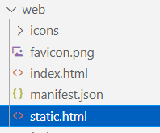
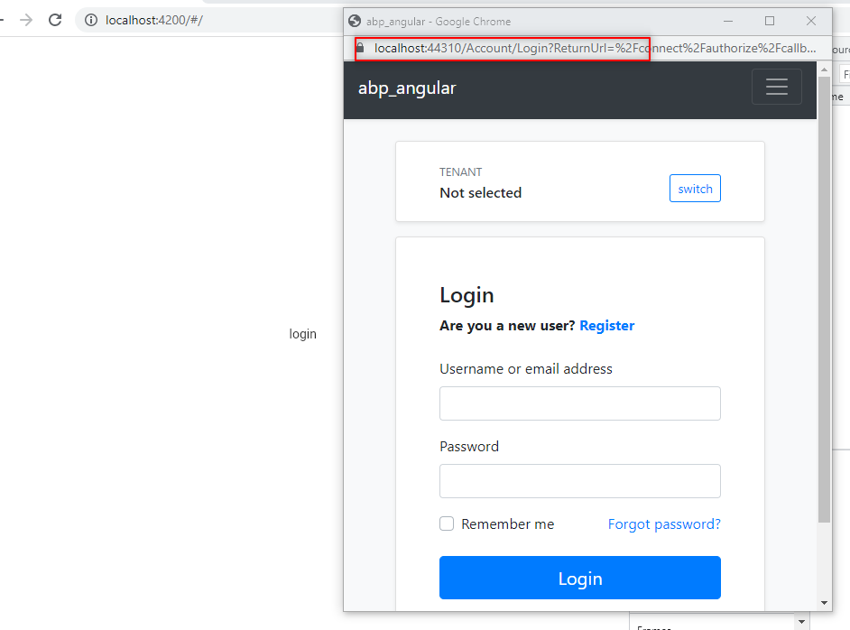
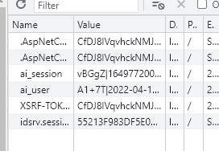
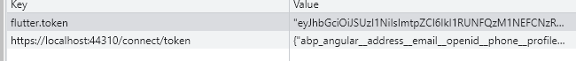

# Authenticate Flutter Web Application in ABP IdentityServer

In this article, we are going to see, How to use ABP authentication in Flutter Web.

Before further progress, I assume that you have ABP project running and flutter application running on a web version in a specific port. In my example I use `4200` as port.

To run flutter web application in a specific port. 
```
flutter run -d chrome --web-port=4200
```

## Configurations in ABP Framework

### Step 1
   Open `appsettings.json` DbMigrator project. And In the `IdentityServer` Section. Please add the Scope.

   ```c#
"FlutterApp": {
        "ClientId": "FlutterApp",
        "ClientSecret": "1q2w3E",
        "RootUrl": "https://localhost:4200"
      }
   ```

### Step 2
Open `IdentityServerDataSeedContributor` inside `Domain\IdentityServer`. Under `CreateClientsAsync` function. Paste the below configuration at the end of the function.

```c#
var appClientId = configurationSection["FlutterApp:ClientId"];
            if (!appClientId.IsNullOrWhiteSpace())
            {
                var appRootUrl = configurationSection["FlutterApp:RootUrl"].TrimEnd('/');

                await CreateClientAsync(
                  name: appClientId,
                  scopes: commonScopes,
                  grantTypes: new[] { "authorization_code", "client_credentials" },
                  secret: configurationSection["FlutterApp:ClientSecret"]?.Sha256(),
                  requireClientSecret: false,
                  redirectUri: "http://localhost:4200/static.html",
                  corsOrigins: new[] { appRootUrl.RemovePostFix("/") }
                );
            }
```
### Step 3
Now run the DbMigrator project. The above configuration will be updated in the database.

Thats all from the ABP framework side.

## Configurations in Flutter Web

### Step 1
Inside the web folder create a static html file, In this case I name it as `static.html`.



```html
<!doctype html>
<html lang="en">

<head>
    <meta charset="utf-8">
    <title>Connection Succeeded</title>
    <meta name="viewport" content="width=device-width, initial-scale=1">
</head>

<body>
</body>
<script>
    // Line to be noted
    window.opener.postMessage(window.location.href, '*');
</script>

</html>
```

### Step 2
In your login file, Place a button, In the onclick trigger a function.

```dart
  @override
  Widget build(BuildContext context) {
    return Scaffold(
      body: Center(
          child: MaterialButton(
        child: Text("login"),
        onPressed: () {
          oAuthInit();
        },
      )),
    );
  }
```

### Step 3
Install OAuth Dependency from pub. and import it in your login.dart file.

[OAUTH2 Client Library](https://pub.dev/packages/oauth2)

```dart
import 'package:oauth2_client/access_token_response.dart';
import 'package:oauth2_client/oauth2_client.dart';
import 'package:oauth2_client/oauth2_helper.dart';
```

### Step 4
Now paste the below code in the Login button's onclick function. And it should be an async function.

```dart
oAuthInit() async {

    final currentUri = Uri.base;
    
    final redirectUri = Uri(
      host: currentUri.host,
      scheme: currentUri.scheme,
      port: currentUri.port,
      path: '/static.html',
    );

    OAuth2Client client = OAuth2Client(
        authorizeUrl: 'https://localhost:44310/connect/authorize',
        tokenUrl: 'https://localhost:44310/connect/token',
        customUriScheme: currentUri.scheme,
        redirectUri: redirectUri.toString(),
        credentialsLocation: CredentialsLocation.HEADER,
        scopeSeparator: '+');

    OAuth2Helper oauth2Helper = OAuth2Helper(
      client,
      grantType: OAuth2Helper.AUTHORIZATION_CODE,
      clientId: 'FlutterApp',
      clientSecret: '1q2w3E',
      scopes: [
        "email",
        "openid",
        "profile",
        "role",
        "phone",
        "address",
        "abp_angular"
      ],
    );

    var tokenResponse = await oauth2Helper.getToken();

    AccessTokenResponse response = (tokenResponse as AccessTokenResponse);

    if (response.accessToken != null) {
      SharedPreferences prefs = await SharedPreferences.getInstance();

      prefs.setString(Constants.TOKEN, response.accessToken!);
    }
  }
```

Now run the application.


Click the login button.



you can findout that our abp authentication service will poped up.

When you login with your correct credentials, it will saved in your cookies and also you can check the token is stored in the localstorage as we used shared preference.





Hurrah, Now the Authentication will work perfectly.
